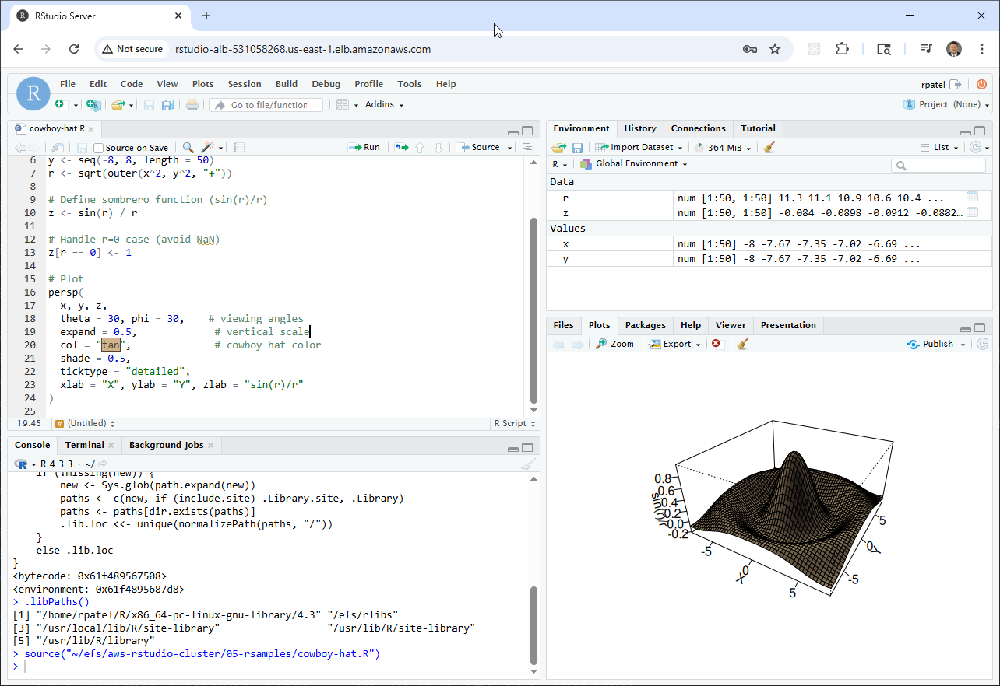
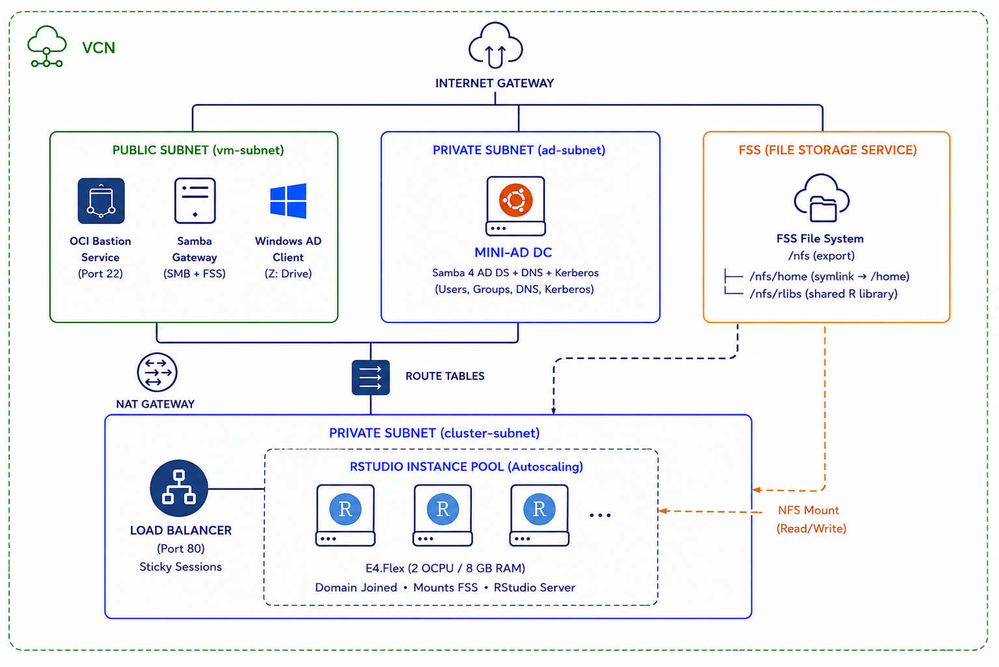
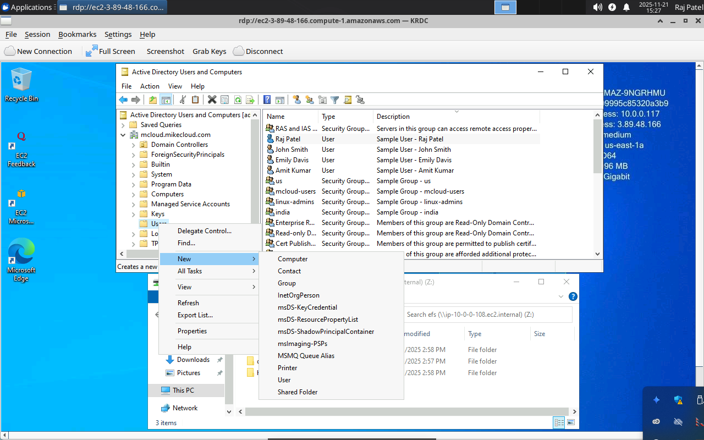
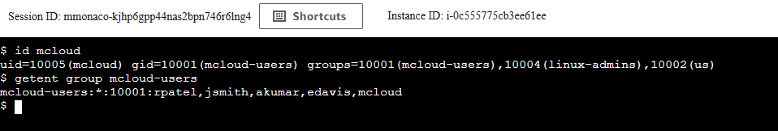

# OCI RStudio Cluster

This project extends the original **OCI Mini Active Directory** lab by deploying an **RStudio Server cluster** on Oracle Cloud Infrastructure (OCI). The cluster is designed for data science and analytics workloads, where multiple users need a scalable, domain-joined environment with consistent package management.



Instead of relying only on per-user libraries stored on ephemeral instance disks, this solution integrates **OCI File Storage Service (FSS)** as a shared package and data backend. This allows RStudio nodes in an Instance Pool to mount a common FSS location, ensuring that installed R packages and project files are accessible across all nodes.

Key capabilities demonstrated:

1. **RStudio Server Cluster with Load Balancer** – RStudio Server (Open Source Edition) deployed across multiple OCI compute instances, fronted by an OCI Load Balancer for high availability and seamless user access.
2. **FSS-Backed Shared Library** – FSS mounted at `/nfs/rlibs` and injected into `.libPaths()`, enabling shared R package storage across the cluster.
3. **Mini Active Directory Integration** – A Samba-based mini-AD domain controller provides authentication and DNS, so RStudio logins are domain-based and centrally managed.

Together, this architecture provides a reproducible, cloud-native RStudio environment where users get both personal home-directory libraries and access to a shared, scalable package repository.



## Prerequisites

* [An OCI Account](https://cloud.oracle.com/)
* [Install OCI CLI](https://docs.oracle.com/en-us/iaas/Content/API/SDKDocs/cliinstall.htm)
* [Install Latest Terraform](https://developer.hashicorp.com/terraform/install)
* [Install Latest Packer](https://developer.hashicorp.com/packer/install)

## Build Workflow

Four-phase deployment:

1. **01-directory** — Active Directory (mini-AD DC), VCN, subnets, bastion, SSH keys, passwords
2. **02-servers** — FSS file system, Linux Samba gateway, Windows AD client
3. **03-packer** — Builds the `rstudio-image` custom OCI compute image (R + RStudio Server + AD packages)
4. **04-cluster** — OCI Load Balancer, Instance Pool (autoscaling), domain join at boot

## Download this Repository

```bash
git clone https://github.com/mamonaco1973/oci-rstudio-cluster.git
cd oci-rstudio-cluster
```

## Build the Code

Run [check_env](check_env.sh) to validate your environment, then run [apply](apply.sh) to provision the infrastructure.

```bash
./apply.sh
```

### Build Results

When the deployment completes, the following resources are created:

- **Networking:**
  - A VCN with public (vm-subnet), private (cluster-subnet), and management subnets
  - Internet Gateway for public subnet; NAT Gateway for private cluster instances
  - Route tables and security lists scoped to required ports
  - DNS resolution provided by the Mini-AD domain controller

- **Active Directory Server:**
  - Ubuntu A1.Flex instance running Samba 4 as a Domain Controller and DNS server
  - Configured Kerberos realm and NetBIOS name for centralized authentication
  - Integrated with the RStudio cluster for domain-based logins

- **OCI File Storage Service (FSS):**
  - FSS file system with a mount target in vm-subnet
  - Single `/nfs` export mounted by the Samba gateway and all cluster instances
  - `/nfs/home` symlinked to `/home` — AD user home directories persist across Instance Pool scale events
  - `/nfs/rlibs` shared R library path, writable by `rstudio-admins` group members

- **Linux Samba Gateway:**
  - Ubuntu E4.Flex instance in vm-subnet (public IP)
  - Mounts FSS at `/nfs` and re-exports it as a Samba SMB share (`\\<ip>\nfs`)
  - Domain-joined via `realm join`; Windows client maps `Z:` to the SMB share

- **Windows AD Client:**
  - Windows Server 2022 E4.Flex instance in vm-subnet (public IP)
  - Domain-joined at boot; `Z:` drive mapped to `\\samba-gateway\nfs`
  - Used for Active Directory Users and Computers administration

- **Custom RStudio Image:**
  - Built with Packer: R (latest from CRAN), RStudio Server (Open Source Edition), AD/NFS packages
  - PAM configured for SSSD/AD authentication with automatic home-directory creation on FSS
  - `/etc/skel/nfs` symlink baked in so every new AD user gets `~/nfs` on first login

- **RStudio Instance Pool + Load Balancer:**
  - OCI flexible Load Balancer (port 80) with sticky LB cookie sessions
  - Instance Pool of E4.Flex 2c/8GB instances in the private cluster-subnet
  - Autoscaling: CPU > 60% → scale up, CPU < 10% → scale down; min=2, max=4
  - Each instance domain-joins at boot, mounts FSS, and starts RStudio Server

### Users and Groups

As part of this project, when the domain controller is provisioned, a set of sample **users** and **groups** are automatically created through Terraform-provisioned scripts. These resources are intended for **testing and demonstration purposes**.

#### Groups Created

| Group Name      | Group Category | Group Scope | gidNumber |
|-----------------|----------------|-------------|-----------|
| rstudio-users   | Security       | Universal   | 10001     |
| india           | Security       | Universal   | 10002     |
| us              | Security       | Universal   | 10003     |
| linux-admins    | Security       | Universal   | 10004     |
| rstudio-admins  | Security       | Universal   | 10005     |

#### Users Created and Group Memberships

| Username | Full Name   | uidNumber | gidNumber | Groups Joined                                      |
|----------|-------------|-----------|-----------|-----------------------------------------------------|
| jsmith   | John Smith  | 10001     | 10001     | rstudio-users, us, linux-admins, rstudio-admins    |
| edavis   | Emily Davis | 10002     | 10001     | rstudio-users, us                                  |
| rpatel   | Raj Patel   | 10003     | 10001     | rstudio-users, india, linux-admins, rstudio-admins |
| akumar   | Amit Kumar  | 10004     | 10001     | rstudio-users, india                               |

#### Understanding `uidNumber` and `gidNumber` for Linux Integration

The **`uidNumber`** and **`gidNumber`** attributes are critical when integrating Active Directory with Linux systems using **SSSD**. These attributes allow Linux hosts to recognize and map AD users and groups into the POSIX user and group model.

### Creating a New RStudio User

Follow these steps to provision a new user in the Active Directory domain and validate their access to the RStudio cluster:

1. **Connect to the Domain Controller**
   - Log into the **Windows AD client** via Remote Desktop (RDP).
   - Use the `rpatel` or `jsmith` credentials provisioned during deployment.

2. **Launch Active Directory Users and Computers (ADUC)**
   - From the Windows Start menu, open **"Active Directory Users and Computers."**
   - Enable **Advanced Features** under the **View** menu to access the Attribute Editor tab.

3. **Navigate to the Users Organizational Unit (OU)**
   - Expand the domain (e.g., `mcloud.mikecloud.com`).
   - Select the **Users** OU where all cluster accounts are managed.

4. **Create a New User Object**
   - Right-click the Users OU and choose **New → User.**
   - Provide:
     - **Full Name:** e.g., "Mike Cloud"
     - **User Logon Name (UPN):** e.g., `mcloud@mcloud.mikecloud.com`
     - **Initial Password:** Set an initial password.



5. **Assign a Unique UID Number**
   - Open **PowerShell** on the Windows AD client.
   - Run the script located on the `Z:` drive:
     ```powershell
     Z:\nfs\oci-rstudio-cluster\06-utils\getNextUID.bat
     ```
   - This returns the next available **`uidNumber`** to assign to the new account.

6. **Configure Advanced Attributes**
   - In the new user's **Properties** dialog, open the **Attribute Editor** tab.
   - Set:
     - `gidNumber` → **10001** (shared GID for `rstudio-users`)
     - `uid` → match the AD login name (e.g., `mcloud`)
     - `uidNumber` → the value returned from `getNextUID`

7. **Add Group Memberships**
   - Go to the **Member Of** tab.
   - Add the user to **rstudio-users** (grants standard RStudio access) and any geographic/departmental group.

8. **Validate User on Linux**
   - SSH to the Linux Samba gateway:
     ```bash
     ssh -i 01-directory/keys/Private_Key ubuntu@<linux_public_ip>
     ```
   - Confirm the user's identity mapping:
     ```bash
     id mcloud
     ```
   - Verify the output shows the correct UID, GID, and group memberships.



9. **Validate RStudio Access**
   - Open the Load Balancer URL in a browser (shown by `./validate.sh`):
     ```
     http://<lb-public-ip>
     ```
   - Log in with the new AD credentials.

10. **Verify Permissions**
    - By default, the new user is **not** in `rstudio-admins`.
    - Attempting to install packages into `/nfs/rlibs` will fail with a **"Permission denied"** error, confirming they are restricted to their personal user library.

> **Note:** To grant shared-library install rights, add the user to **rstudio-admins** in addition to `rstudio-users`.

### Clean Up Infrastructure

When you are finished testing, remove all provisioned resources with:

```bash
./destroy.sh
```

This deletes the Instance Pool, Load Balancer, custom Packer image, FSS file system, compute instances, and all networking resources.
